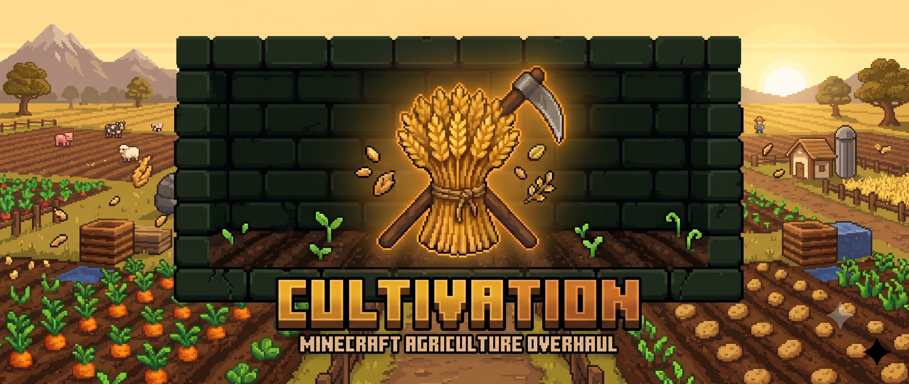

<p align="center">
  
</p>

<p align="center"><strong>Worth growing.</strong></p>

<p align="center">
  <a href="https://www.minecraft.net/"></a>
  <a href="https://fabricmc.net/"></a>
  <a href="LICENSE"></a>
</p>

Cultivation — agriculture overhaul for Minecraft 1.21.1 (Fabric).

Part of **Concord** — a modular collection of system overhauls. Install any, combine all.

---

## For Mod Developers

Cultivation publishes a stable, read-only integration surface under
`com.rfizzle.cultivation.api`, conforming to the
[Concord API Standard](https://github.com/rfizzle/concord/blob/master/API-STANDARD.md).
Use it as a soft dependency: compile against the mod with `modCompileOnly` and
guard every call with `FabricLoader.isModLoaded("cultivation")`. Everything
outside the `api` package is internal and may change in any release. Reads are
server-authoritative; Cultivation has no HUD slot by design, so the surface
ships no HUD accessors, and it exposes no soil mutators — outside mods observe
fertility and react, they don't write it.

### Gradle setup

```gradle
dependencies {
    modCompileOnly "maven.modrinth:cultivation-agriculture-overhaul:<version>"
}
```

### The stable surface

`CultivationAPI` accessors:

- `getFertility(ServerLevel, BlockPos)` — fertility 0–100; 100 for untracked farmland; −1 if the block is not farmland.
- `getSoilInfo(ServerLevel, BlockPos)` — optional record of fertility, enriched chance, remaining Fertilizer dose, and last crop.
- `getFoodEffectiveness(ServerPlayer, ItemStack)` — the multiplier the player's next eat of this item would receive, from the configured `fatigueFloor` up to 1.0.

Array-backed Fabric events (server-side):

- `CultivationHarvestCallback` — fires from the single harvest choke point after Cultivation's own drain and bonuses. Its drops list is mutable: the sanctioned point for other mods to inject bonus produce.
- `CultivationFoodCallback` — fires after a food is consumed and fatigue applied, with the effectiveness that was used. Observation only.

### Usage example

```java
if (FabricLoader.getInstance().isModLoaded("cultivation")) {
    float fertility = com.rfizzle.cultivation.api.CultivationAPI.getFertility(serverLevel, pos);
}
```

Stable item IDs for datapack integrations: `cultivation:fertilizer`,
`cultivation:iron_scythe`, `cultivation:diamond_scythe`,
`cultivation:netherite_scythe`. The scythes carry a `#cultivation:scythes` tag
alongside `#minecraft:enchantable/durability` and `#minecraft:enchantable/mining`.

Full reference: [site/pages/developers.json](site/pages/developers.json).
